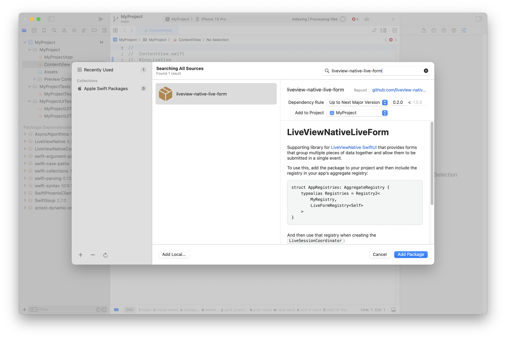
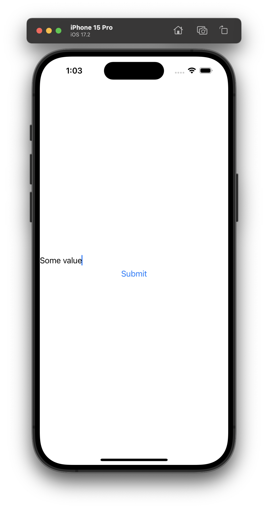

# LiveViewNativeLiveForm

## About

`liveview-native-forms` is an add-on library for [LiveView Native SwiftUI](https://github.com/liveviewnative/liveview-client-swiftui). It adds support for conveniently working with control views grouped within a single form so you can use Phoenix [Form Bindings](https://hexdocs.pm/phoenix_live_view/form-bindings.html) within a LiveView Native application.

## Installation

1. Add this library as a package to your LiveView Native application's Xcode project
* In Xcode, select File → Add Packages...
* Enter the package URL https://github.com/liveview-native/liveview-native-live-form
* Select Add Package



## Usage

import `LiveViewNativeLiveForm` and add the `LiveFormRegistry` to the `addons` list of your `#LiveView`.

```swift
//
//  ContentView.swift
//  KinoLiveView
//

import SwiftUI
import LiveViewNative
import LiveViewNativeLiveForm

struct ContentView: View {

    var body: some View {
        #LiveView(.automatic(
            development: .localhost(path: "/"),
            production: .custom(URL(string: "https://example.com/")!)
        ), addons: [LiveFormRegistry<_>.self])
    }
}
```

To render a form within a SwiftUI template, use the `LiveForm` view and a `LiveSubmitButton` to trigger the form. Attach a `phx-submit` binding to the form with the name of your desired submit event and define the corresponding [handle_event/3](https://hexdocs.pm/phoenix_live_view/Phoenix.LiveView.html#c:handle_event/3) callback.
Forms also require an `id` attribute.

```elixir
defmodule AppWeb.FormLive do
  use Phoenix.LiveView
  use LiveViewNative.LiveView

  @impl true
  def render(%{format: :swiftui} = assigns) do
    ~SWIFTUI"""
    <LiveForm id="my-form" phx-submit="submit">
      <TextField name="my-text" >Placeholder</TextField>
      <LiveSubmitButton>Submit</LiveSubmitButton>
    </LiveForm>
    """
  end

  @impl true
  def handle_event("submit", params, socket) do
    {:noreply, socket}
  end
end
```

<div style="height: 800; width: 100%; display: flex; height: 800px; justify-content: center; align-items: center;">
    
</div>

Form `params` are a string-key map based on the `name` attribute provided to Control Views within the Form.

```elixir
%{"my-text" => "some value"}
```